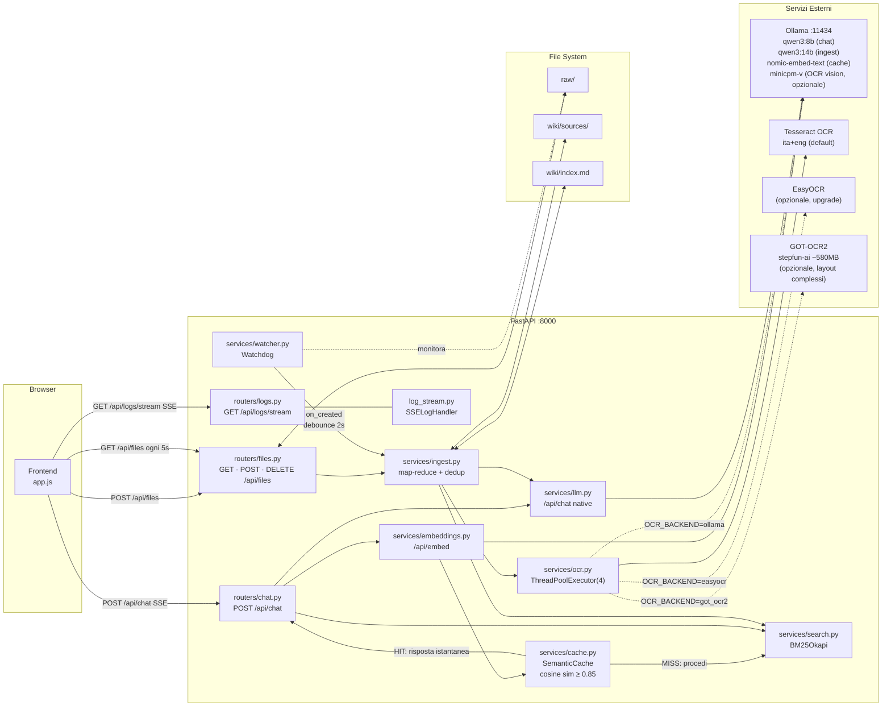
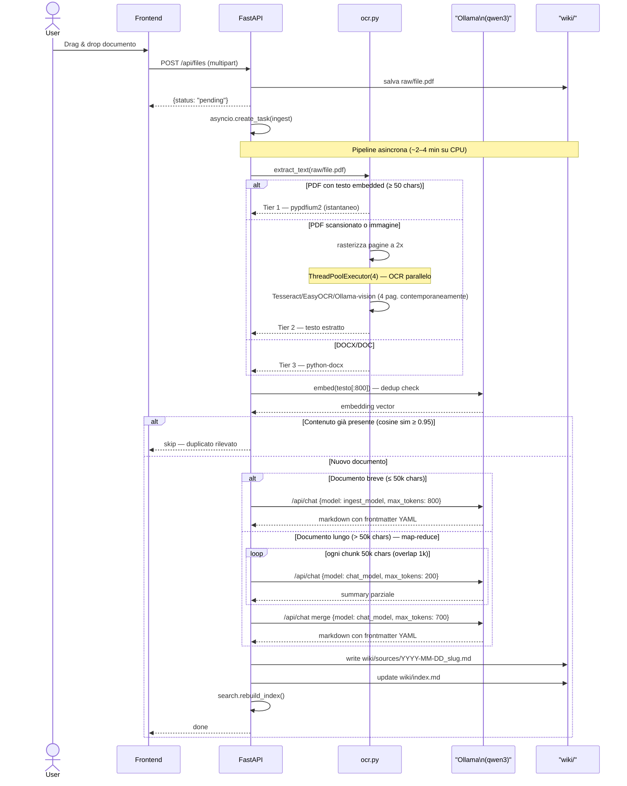
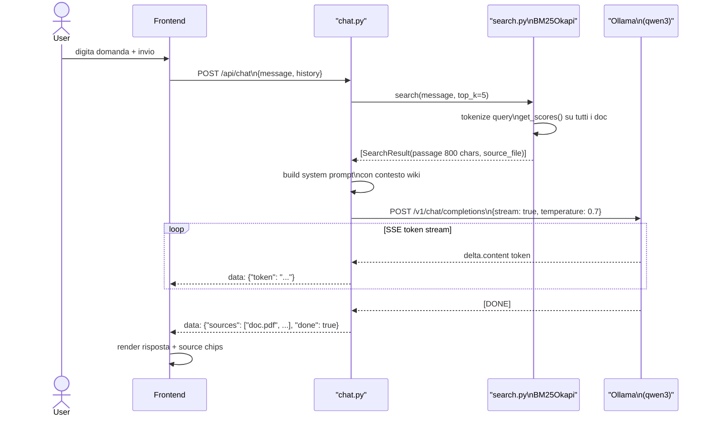
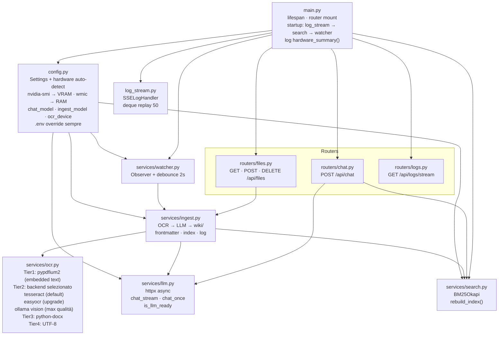

# LLM Wiki — Architettura

## 1. Componenti e interazioni

---

## 2. Pipeline di ingest (file → wiki)

---

## 3. Chat con RAG (BM25 + Ollama)

---

## 4. Struttura moduli e dipendenze

---

## Riepilogo tecnologie

| Layer | Tecnologia | Scopo |
|-------|-----------|-------|
| Frontend | Vanilla JS + HTML/CSS | UI upload, chat, log panel |
| API | FastAPI + uvicorn | REST + SSE streaming |
| LLM chat | Ollama (auto: qwen3:4b–14b) | RAG streaming — modello scelto da VRAM/RAM |
| LLM ingest | Ollama (auto: qwen3:8b–32b-a3b) | Summarizzazione batch PDF→wiki |
| OCR Tier1 | pypdfium2 | Estrazione testo embedded da PDF |
| OCR Tier2 | Tesseract (default) / EasyOCR / GOT-OCR2 / Ollama vision | Scanned PDF, immagini |
| DOCX | python-docx | Documenti Word |
| Search | rank-bm25 (BM25Okapi) | Retrieval per RAG |
| Config | pydantic-settings + `nvidia-smi`/`wmic` | Auto-detect GPU/RAM → model defaults · `.env` override |
| File watch | watchdog | Auto-ingest su drop in raw/ |
| Logging | logging + SSE | Stream log in tempo reale — include hardware summary al boot |
